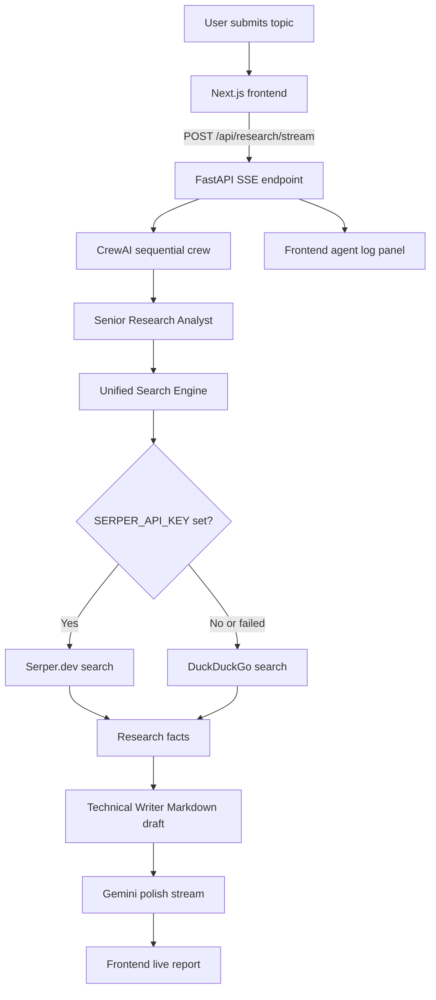

# Smart Briefing — AI Research Agent

AI-powered research briefing app with a decoupled FastAPI backend and Next.js frontend. The backend runs a CrewAI research workflow, searches the web with Serper or DuckDuckGo failover, then streams a Gemini-polished Markdown report to the UI in real time.

## Features

- **Two-agent CrewAI workflow**
  - Senior Research Analyst gathers facts with a unified web search tool.
  - Technical Writer turns findings into structured Markdown.
- **Gemini polish pass** for clearer formatting, tone, and final report quality.
- **Server-Sent Events (SSE)** for live agent logs and streamed report tokens.
- **Search failover** from Serper.dev to DuckDuckGo when Serper is unavailable or not configured.
- **Dark Next.js dashboard** with a live agent workspace, report preview, cancel support, and copy-to-clipboard.
- **Docker Compose support** for running backend and frontend together.

## Architecture



## Project Structure

```text
smart-briefing-app/
├── docker-compose.yml
├── README.md
├── backend/
│   ├── main.py                    # FastAPI app, CORS, router registration
│   ├── config.py                  # Pydantic settings loaded from .env
│   ├── requirements.txt
│   ├── Dockerfile
│   ├── api/
│   │   └── research.py            # POST /api/research/stream SSE endpoint
│   ├── agents/
│   │   ├── analyst.py             # Senior Research Analyst agent
│   │   ├── writer.py              # Technical Writer agent
│   │   └── crew_runner.py         # CrewAI tasks and executor
│   ├── services/
│   │   ├── polish.py              # Gemini streaming polish pass
│   │   └── streaming.py           # CrewAI event bus -> SSE log events
│   └── tools/
│       └── unified_search.py      # Serper -> DuckDuckGo failover search
└── frontend/
    ├── app/
    │   ├── layout.tsx
    │   ├── page.tsx
    │   └── globals.css
    ├── components/
    │   ├── AgentLogPanel.tsx
    │   ├── ReportPanel.tsx
    │   ├── ResearchForm.tsx
    │   └── StatusBar.tsx
    ├── hooks/
    │   └── useResearchStream.ts   # Fetch + SSE parser + abort logic
    ├── lib/
    │   └── types.ts
    ├── package.json
    └── Dockerfile
```

## Prerequisites

- Python 3.11+
- Node.js 20+
- A Gemini API key
- Optional: a Serper.dev API key for Google-powered search
- Optional: Docker and Docker Compose

## Environment Variables

Create `backend/.env` before starting the backend.

```env
GEMINI_API_KEY=your-gemini-api-key
SERPER_API_KEY=your-serper-api-key-optional
CREW_LLM=gemini/gemini-2.5-flash
POLISH_MODEL=gemini-2.5-flash
ALLOWED_ORIGINS=http://localhost:3000
MAX_CREW_WORKERS=4
LOG_LEVEL=INFO
```

| Variable | Required | Default | Description |
| --- | --- | --- | --- |
| `GEMINI_API_KEY` | Yes | — | Used by CrewAI's Gemini LLM and the final polish stream. |
| `SERPER_API_KEY` | No | empty | Enables Serper.dev search. If missing or failing, DuckDuckGo is used. |
| `CREW_LLM` | No | `gemini/gemini-2.5-flash` | CrewAI LLM identifier for the analyst and writer agents. |
| `POLISH_MODEL` | No | `gemini-2.5-flash` | Gemini model used for the final Markdown polish pass. |
| `ALLOWED_ORIGINS` | No | `http://localhost:3000` | Comma-separated CORS origins. |
| `MAX_CREW_WORKERS` | No | `4` | Shared thread-pool size for concurrent crew runs. |
| `LOG_LEVEL` | No | `INFO` | Backend logging level. |

## Local Development

### 1. Start the backend

```bash
cd backend
python3 -m venv venv
source venv/bin/activate
pip install -r requirements.txt

# Create and edit backend/.env first
uvicorn main:app --reload --port 8000
```

Backend health check:

```bash
curl http://localhost:8000/
```

Expected response:

```json
{"status":"online","message":"Smart Briefing Agent Engine"}
```

### 2. Start the frontend

Open a second terminal:

```bash
cd frontend
npm install
npm run dev
```

Open <http://localhost:3000> and submit a research topic.

## Docker Compose

From the repository root:

```bash
docker compose up --build
```

Services:

- Frontend: <http://localhost:3000>
- Backend: <http://localhost:8000>

The compose file mounts source directories for hot reload and reads backend secrets from `backend/.env`.

## API

### `POST /api/research/stream`

Starts a research run and returns an SSE stream.

Request body:

```json
{
  "topic": "Quantum computing in 2026"
}
```

Validation:

- `topic` is trimmed.
- Minimum length: 3 characters.
- Maximum length: 300 characters.

### SSE Events

Each event is emitted as a `data:` JSON payload.

#### Agent log event

```text
data: {"type":"log","agent":"System","event":"status","message":"Starting crew research..."}
```

#### Report token event

```text
data: {"type":"token","text":"## Introduction\n\n..."}
```

#### Done event

```text
data: {"type":"done"}
```

#### Error event

```text
data: {"type":"error","message":"Research agent failed: ..."}
```

| Event type | Description |
| --- | --- |
| `log` | Live CrewAI activity, including task, agent, reasoning, and tool events. |
| `token` | A streamed chunk of the polished Markdown report. |
| `done` | The stream completed successfully. |
| `error` | The backend failed during research or polish. |

## Frontend Behavior

The UI displays:

1. **Connecting to engine...** while the POST request is opening.
2. **Agent research in progress** while CrewAI runs and log events arrive.
3. **Generating final report** while Gemini streams Markdown tokens.
4. **Report Complete** when the `done` event arrives.

Users can cancel an in-progress request. The backend also checks for client disconnects to avoid wasting LLM tokens.

## Notes

- The backend endpoint is `/api/research/stream`, not `/api/research`.
- The frontend reads `NEXT_PUBLIC_API_URL`; if omitted, it defaults to `http://localhost:8000`.
- Serper is optional. DuckDuckGo fallback requires no API key.
- CrewAI tracing is disabled in `run_crew()` by default.
